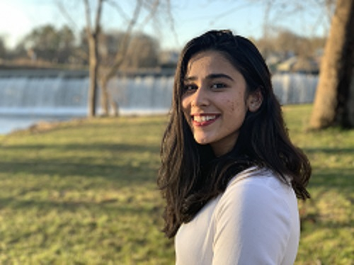
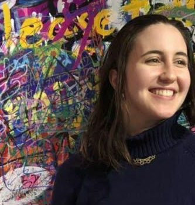

**Lab Leader: Professor Vis Taraz**

---

Current Members:

**Vatsala Ramanan**

.

My name is Vatsala Ramanan (class of 2022) and I am studying Quantitative Economics and Government at Smith College. I am interested in the intersection of climate change and public policy research in developing countries. I have worked with Professor Taraz since February 2020.

**Manal Fatima**

 

My name is Manal Fatima, class of 2023, and I am double majoring in Quantitative Economics and Middle East Studies at Smith College. I am interested in development economics as well as economic history and intend to utilize this in the field of public policy. I have worked with Professor Taraz since February 2020.

---

Past Members: 
 
**Julia Bouzaher**

.

I am a 2020 graduate in Economics and Statistical & Data Sciences at Smith College. I am interested in the environmental and development economics applications of spatial data science. I have worked with Professor Taraz since January 2019.

**Ahana Raina**

I am a 2020 graduate in Quantitative Economics at Smith College. I am interested in development economics with a focus on policy implementation. I have worked with Professor Taraz since Summer 2018.

